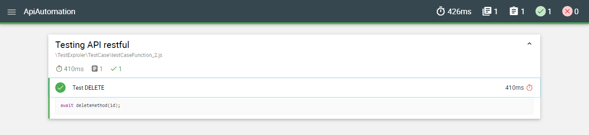

# Digital Skola API Automation using Supertest

## Data Diri

|              |                         |
| ------------ | ----------------------- |
| Nama Lengkap | **Amelia Widya Andini** |
| Email        | **aandini072@gmail.com**|
| Kelas        | **QA Engineer**         |

## How to run this automation

1. install dependencies using
   `npm install`
2. run command for run API Automation
   `npm run test:mocha`

## Report

1. Get Method

2. Post Method

3. Put Method

4. Patch Method

5. Delete Method

